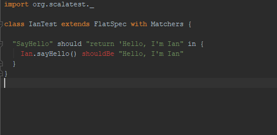
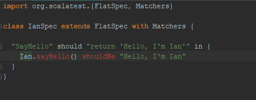
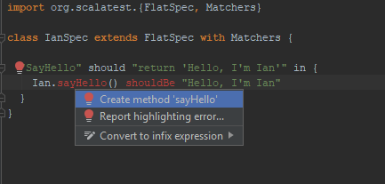
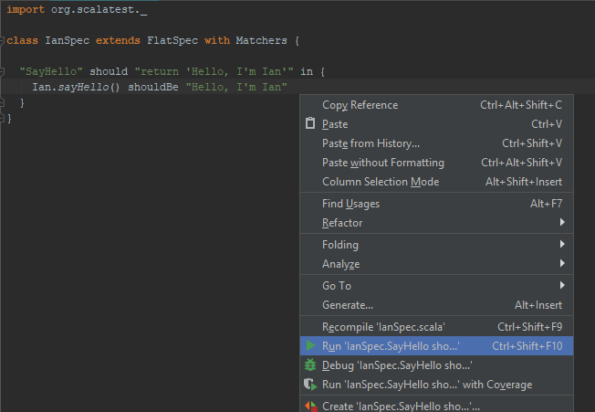

# Chapter 4
## Objects

We're now going to be introduced to some of the fundamental building blocks we use to write programs. We've seen objects already. In fact, we created one called `HelloWorld` in the last section. But what is an object? Under the hood computers don't understand programming languages in the way that we write them. They just see a program as a series of ones and zeros, which tell them to do things at a very low level, such as "Put a 1 in memory register A", or "If memory register A contains a 1 and memory register B contains a 0, then put a 1 in memory register C". In the early days of computing people wrote programs at this level, but as computers and programs got more complex this approach became impossible to manage. Can you imagine having to think at the level of memory registers when writing something like a big budget game? Programming languages were developed to provide higher levels of abstraction over the nuts and bolts, and one very successful approach to this abstraction is called **Object Oriented Programming**. Scala is one of these object oriented programming languages.

The basic premise of object oriented programming (OOP from now on) is that you should be able to think about your program in the same way as you think about real life. In the real world we're surrounded by objects: a house, a car, a saucepan, my neighbour's cat, etc etc. Objects tend to have attributes about them, and behaviour. Let's take an example. If I go to the fridge and take out a milk carton, what are some of the attributes that this carton has? Well, it has a colour, it has a logo printed on it, it's made from a certain mix of materials, it has a capacity for how much milk it can hold, and it's currently holding a certain volume of milk. How about behaviours? Admittedly it's not doing much just sitting on the breakfast table, but I can pour some milk out of it, which would mean that the attribute for how much milk it currently contains would change. Other behaviours might be adding milk to it, or changing the logo on it.

OOP encourages you to build your program out of a collection of objects, each with attributes and behaviour, and get them to interact with each other to do something useful.

Let's take a look back at the HelloWorld program we wrote. The code looked like this:

```
object HelloWorld extends App {
  println("Hello World!")
}
```

There are actually many objects involved in this tiny program. The first is easy to see. It's called `HelloWorld` and you created it by typing the word `object` followed by the name you wanted to give the object, with the body of the object between curly braces. Ignore the `extends App` for a moment. I'll explain it in a second. The object body can contain attributes (describing the characteristics and current state of the object) and behaviour. Our object doesn't have any attributes, but it does have some behaviour that causes "Hello World!" to be printed to the terminal.

But hang on a second! You said there were many objects. Where are the others? Scala comes with loads of its own objects which you'll take advantage of to write your programs. `println` is actually some behaviour that is defined in one of these objects called `Predef`. If you hold **Ctrl** on Windows or **Cmd** on the Mac, and click on the word `println`, IntelliJ will open up the file containing the definition of this behaviour. You'll be in the body of the `Predef` object, and should be looking at the follow code:

```
def println(x: Any) = Console.println(x)
```

This is behaviour written down as a method. Objects can have two types of behaviour. The first is behaviour that runs as soon as the object is created, like our `println("Hello World!")`. The second type is behaviour that is only run if it is specifically called from somewhere else in the program, and methods are of this second type. The vast, vast majority of behaviour you'll write will be methods.

In a similar way to how we create objects with the word `object` followed by the name we want to give our object, we create methods with the word `def` followed by the name we want to give our method. After that there's some difference though. Notice the `(x: Any)` straight after the method name. When you call a method you can pass it some data, which it might need to be productive. Going back to our milk carton example, we said there was some behaviour for pouring milk. We might express this as a method in which we can specify how much milk we want to pour. A word on definition: everything on the left hand side of the `=` is called the **method definition**, and everything on the right hand side is called the **method body**. The method definition specifies the method name, what data it takes in when it is called, and what data it might return to the caller. The method body is where you describe how the method should actually do what it needs to do. Ignoring the method body, our milk carton object might now look like this:

```
object MilkCarton {
  def pourVolumeOfMilk(millilitres: Int) = 
}
```

You've now seen two examples of defining the data to be passed into a method: `(x: Any)` and `(millilitres: Int)`. These are called **method parameters**, and they are written inside parentheses directly after the name of the method. They have two parts, separated by a colon. The first part is the parameter name, which in our examples are `x` and `millilitres`. The second part is the type of the parameter. There are some types included with the language, such as `Int` which stands for integer, meaning a whole number, `Float` which represents a floating point number, meaning a number with a decimal point, and `String` which represents text like "Hello World!". In the `pourVolumeOfMilk` method, we've specified that the method parameter is of an `Int` type, as it won't make sense to call the method with a string for example. What would `pourVolumeOfMilk("HelloWorld!")` mean? In the `println` method, the `Any` type is a catch all, meaning you're allowed to pass anything to it. In our program we're actually calling it with a String ("Hello World!"). You can think of parameters as containers with different shapes. Maybe an Int container is long and thin, and a String container is short and fat. So a long, thin integer will fit nicely in an Int container, but won't squeeze into a String container. And each parameter container has the parameter name stamped on the outside. So in the method body we can refer to the parameter by name, and the computer will go find the container with the right name, and get its contents out for us to use.

Let's have a look at what's happening in the method body for the `println` method in the `Predef` object. The method body is `Console.println(x)`. This is what the computer will run when we call the `println` method on the `Predef` object from our `HelloWorld` object. This method body is actually showng the standard way of calling a method on an object. `Console` is another object, and it also has a method called `println`. The syntax for calling methods on objects is to write the object name, followed by a period, followed by the method name, with method parameters within parentheses. If you like you can look at the `println` method in the `Console` object, by holding **Ctrl** or **Cmd** and clicking on the method name. You can see that our simple program is actually working by calling a method on an object, which is calling a method on another object, and so on and so on until eventually we'll get to some object that knows how to actually do the writing to the terminal!

So now we know enough to understand what's going on in the `Predef` object. The whole method looks like this:

```
def println(x: Any) = Console.println(x)
```

We've got a method definition creating a method called `println` which takes a single parameter called `x`, which can be of `Any` type. We're calling this method from our HelloWorld object like this:

```
println("Hello World!")
```

So we're passing in a String type parameter with the value "Hello World!" to the `println` method, where it gets put in the parameter container with the name "x" stamped on the outside. When the computer sees the `x` in the method body, it goes and finds the parameter container called "x", gets the value out of it (i.e. the string "Hello World!"), and passes that value as a method parameter to the `println` method on the `Console` object.

Phew, that was quite complicated! Well done if you got that first time. If not, you might want to re-read that section, but don't worry too much. It will all become a lot clearer when we start writing some code.

There's one final confusing thing we should cover before we move on. Some of you might be thinking, "He told me that the syntax for calling methods was the object name, followed by a period, followed by the method name. But we're not using the Predef object name when we call println on it. Huh?" Well, Predef is a special object and doesn't play by the normal rules, so you can call any of the Predef methods without having to use the object name first. In other words, `println("Hello World!")` and `Predef.println("Hello World!")` are exactly equivalent.

Oh, and I almost forgot! I said I'd explain what that `extends App` thing is. When you run a program, the computer needs to know where to start it from. You might have hundreds of files, loads of objects, thousands of methods, so how do you specify where the beginning is? Well, you're allowed to write `extends App` for just one of your objects in the whole program, and that signifies to the computer that it should start running the program from this object. There's actually one other way of specifying the start point of your program, and that's to write a method called `main` in one of your objects. This is a special method that has a specific method definition, and can only appear once in your whole program. If we were to rewrite our `HelloWorld` object to use the `main` method, it would look like this:

```
object HelloWorld {
  def main(args: Array[String]) = {
    println("Hello World!")
  }
}
```

When you run the program, the computer looks for this method called `main` which takes a single method parameter. The parameter is traditionally called `args` which is short for "arguments", and its type is `Array[String]`. We'll learn about arrays later, but you can think of them like a list. So in this example, `args` is like a list of Strings. It's a way for your program to access arguments that can be passed in to it when you run it from the command line. You don't need to understand this for now, so if it doesn't make sense don't worry, we'll be covering it later. Note that this method body is inside curly braces, whereas the `println` body wasn't. Braces are optional if you can fit the method body on a single line, but have to be there if your body takes up more than one line.

## Test Driven Development

We're going to play around creating some objects and methods, but first I'd like to talk to you a bit about testing. This is something that's not often covered in beginner's programming books, but it's a hugely important skill to have as a professional coder, so I think it's good to get used to it right from the start. Programs can be enormously complicated, and when you're releasing programs into the wild you want to minimise the chance that they don't work the way you intended them to. The best way to make sure it's doing what you want it to is to test it. Now you could sit down with the running application and manually walk through every scenario you can think of, and then repeat that every time you make a change to the code to make sure the change hasn't broken anything. Or you could write another program to automatically test your program. A program that never gets bored, doesn't get tired and make mistakes, and runs through all the scenarios in the fraction of the time it would take a person. I know which one I'd rather do.

There are whole books written on Test Driven Development (or TDD), so I'm only going to lightly scratch the surface here. More like scuff it a bit. But the basic concept is that you think about what you want your program to do, you specify how you expect that behaviour to work by writing a test for it, and then you write the code to make the test pass. We're going to be using a test framework called **Scalatest** which will handle running our tests and telling us whether they've passed or not. We'll need to install it as a dependency in our project. Dependencies are external pieces of code that you can use in your project, but that don't come packaged up with the standard install of Scala, so you need to install them. Fortunately it's very easy to do this using the Scala Build Tool (sbt). Open up the `build.sbt` file which you can see in the project view. We're going to add a line to the bottom of this file. You can find the command to install the latest version of Scalatest by Googling for "Install Scalatest". As of the time of writing the command is `libraryDependencies += "org.scalatest" % "scalatest_2.12" % "3.0.5" % "test"`. So your `build.sbt` file should look something like:

```
name := "NameOfMyProject"

version := "0.1"

scalaVersion := "2.12.8"

libraryDependencies += "org.scalatest" % "scalatest_2.12" % "3.0.5" % "test"
```

Click out of the `build.sbt` file, and IntelliJ should prompt you to import the dependency. Just click to enable auto-imports. If you don't get the prompt, go to the terminal view and run `sbt update`.

First I'm going to think about what I want my program to do, then I'm going to write a test for it, then write the code to make it work. My program is going to be very simple. I want an object to represent myself, so I'll call it "Ian". And I want Ian to be able to introduce himself, so I'd like a method that will return the string "Hello, I'm Ian" when it's called. And that's it for now. So we can start writing our test.

Feel free to look around the Scalatest website. There are many different styles of writing tests, so you might decide you prefer a particular one later, but for now we're going to use FlatSpec as I think it has a nice syntax. I'm going to create my first test file, then I'll explain what's going on. Right click on the `src/test/scala` folder in the project view, and select **New -> Scala Class**. Leave the type as Class, and call the file IanSpec (or you can use your own name instead of Ian!). Copy the following into your file:

```
import org.scalatest._

class IanSpec extends FlatSpec with Matchers {

  "SayHello" should "return 'Hello, I'm Ian'" in {
    Ian.sayHello() shouldBe "Hello, I'm Ian"
  }
}
```

I'm going to walk through what's happening here, but to fully understand it you'll need concepts that we're not going to cover until later, so don't worry if you don't fully get it. You can treat it like magic for now. The first line is telling the computer that we'll be using stuff from Scalatest in this file. We're then creating a class called IanSpec. We'll learn a lot more about classes very soon, but at the moment you can think of them as similar to objects. I know I'm going to be creating an object called "Ian", and this file is all about testing that Ian object, so I'm going to follow the FlatSpec convention of naming the class with the name of the thing I want it to test followed by the word "Spec". The `extends FlatSpec with Matchers` is telling the computer that we're going to be using some specific stuff from Scalatest inside this class. There's an opening curly brace at the end of the class definition line, and a matching closing curly brace at the end of the file. Everything between these is the body of the class, where the tests live.

The tests have their own special language, which isn't the standard Scala syntax you'll use in your actual program. The structure of the test is: string describing what you're testing - the word **should** - string describing what the behaviour you're testing should be - the word **in** - then the test body between curly braces. So you should be able to tell that this test is about making sure that the `sayHello` method of the `Ian` object will return the string "Hello, I'm Ian".

In the test body, we start by calling the method we want to test. Remember the syntax for calling methods on objects? It's object name, followed by a period, followed by the method name with parenthesis straight after. Previously we saw this with `Console.println(x)`, and here we're calling `Ian.sayHello()`. I don't need to pass any parameters into this method, as it wouldn't do anything with them, so the parentheses are empty. The `shouldBe` compares the result of the method call on the left of it to what's on the right of it. If they match up then the test passes. If they're different the test will fail.

You should be getting some red text in IntelliJ, signifying that something's wrong. It probably looks something like this:



That's because we haven't created an object called Ian yet, so IntelliJ sees that, can't find what it refers to, and flags up a problem. We could fix this by right clicking on the `src/main/scala` folder, selecting **New -> Scala Class**, changing the kind to **Object**, naming it Ian, and clicking **OK**. But there's an easier way. IntelliJ has loads of clever shortcuts to help you work faster. If you click on the red Ian you can either press **Alt + Enter** or click on the little red lightbulb that appears, then select **Create object 'Ian'** from the dropdown list, like so:


It asks you where you want to put the object, so select **New File**. Unfortunately it's not clever enough to put it in the `main/scala` folder, so look in the project view and you'll see your new file in the `test/scala` folder. Just drag it up into the `main/scala` folder, and hit **Refactor** in the box that pops up. Go back to the test file, and you'll see that `Ian` looks ok now, but `sayHello` is now red.



You've guessed it. That's because there's no `sayHello` method in the `Ian` object. Let's do the same trick again. Click on the method name, then **Alt + Enter** or click on the red lightbulb, and select **Create method 'sayHello'**.



Your object should now look like this:


Those `???` mean there's no method body yet, so reminding you to write something. You might also have spotted something different about the method definition. What's that `:Nothing` after the parentheses? This is the return type of the method. Remember how method parameters have types? Our carton of milk had a `def pourVolumeOfMilk(millilitres: Int)`, where the millilitres parameter had a type of Int. Most useful methods return something to the caller of the method, and the thing that's being returned has a type. For instance, we might have a method that takes an Int, and returns another Int with the value of double the input. That would look something like:

```
def double(x: Int): Int = x + x
```

In Scala, most of the time you don't have to type in the return type, as it can work it out for itself. But IntelliJ will helpfully display what it thinks is the return type for you anyway.

Ok, let's write some code instead of those question marks. I'm actually going to write something that will make the test fail to start with, just so we can see what a failing test looks like. My method will look like this:

```
def sayHello() = "Hello, I'm Snoopy"
```

Go back to your test file, and all that red stuff should have gone. Hopefully we're all good to go! Right click somewhere in your test, or on the name of the test file in the project view, and select **Run 'IanSpec.SayHello sho...'**, or press **Ctrl + Shift + F10**.



In the Run view at the bottom of IntelliJ you should see the test output, saying there's a failed test and some info about it. There's a lot of stuff in the output you don't need to worry about, but you can see the explanation for why it failed. It was expecting "Hello, I'm Ian", but got "Hello, I'm Snoopy". You can even click the **Click to see the difference** link for a nice comparison of the expected and actual result.


Let's fix our code so our test can pass. Go back to the Ian object, and change "Snoopy" to "Ian", then rerun the test. It's a bit small to see, but everything's green which is a good sign, and you can see that 1 test passed out of 1 test run, and on my laptop it took 15 ms to complete the test.


Now we can be sure that the `Ian.sayHello` method will always return "Hello, I'm Ian", and if you accidentally change it while you're coding you'll find out about it as soon as you run your tests. Result!

### Practice

Here are a few challenges to help you practice what you've learnt so far.

1. Add some behaviour to the `Ian` object to allow it to say goodbye. Start by writing a test for the behaviour, then write the code to make the test pass. Your test can go in the `IanSpec` class body, below the existing test.
2. Add a method called `echo` to the `Ian` object, which takes a string as a method parameter, and just returns the string when the method is called. Don't forget to write a test first.
3. Use the `Ian` object in our actual `HelloWorld` program, rather than just using it from the tests. Try to get the `HelloWorld` object to print "Hello, I'm Ian" to the terminal instead of "Hello World!"

[Next chapter](Section05.md)